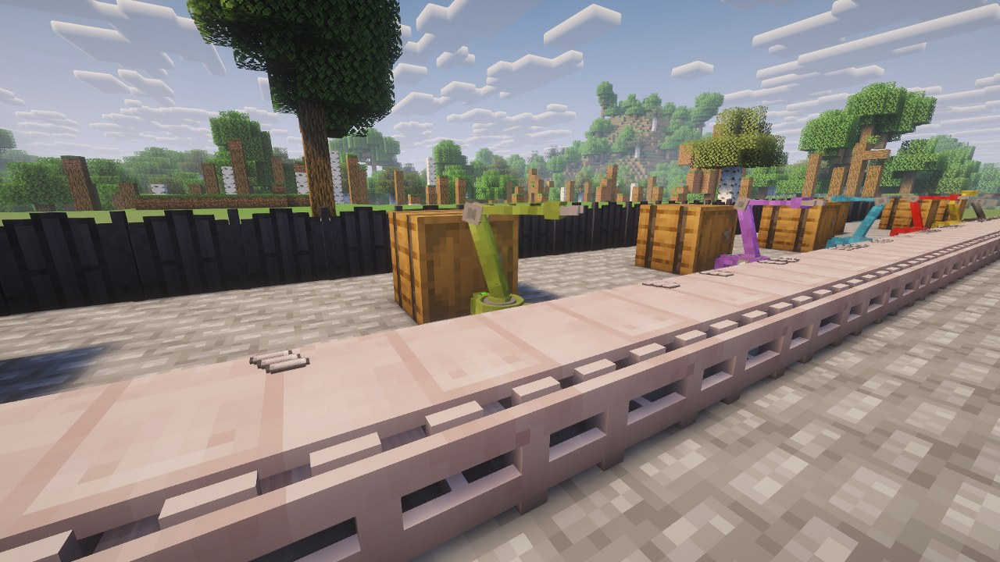

# Factor'I/O


**Factorio's inserters, transport belts and assembling machines, in Minecraft.** Items move
between the inventories you already have — vanilla or from any other mod — and crafters turn
them into the parts of the next machine.

**Forge 1.20.1** · Java 17 · MIT · **beta**

**[Download on CurseForge](https://www.curseforge.com/minecraft/mc-mods/factoryio)** ·
📖 **[Wiki](https://github.com/DrimoZ/FactoryIO/wiki)** ·
[Discord](https://discord.gg/YY9gk63rKz) ·
[Changelog](CHANGELOG.md)

---

## What is in it

| | |
|---|---|
| **Inserters** | Seven, from the coal-fed burner to the stack filter inserter. They take from the block behind and put into the block in front, and only pick up what the target will accept. Filters by item or by tag, redstone conditions, an on/off switch. |
| **Transport belts** | Three tiers — 10, 20 and 40 items/s — with two lanes, curves, side merges and ramps. Inserters drop on the far lane, as in Factorio. |
| **Crafters** | Factorio's assembling machine, in three tiers. Pick a recipe from an icon grid, feed it from any side; it accepts two crafts ahead and no more. Item and fluid recipes. |
| **Modules** | Speed, productivity, efficiency, in three tiers, for inserters and crafters — plus an Advanced Redstone Module. |
| **Recipes** | Factorio's component chain: plates, gears, cables, electronic and advanced circuits, processing units. Forge tags throughout, so other mods' plates and circuits work. |
| **Data-driven** | A JSON file adds an inserter, a belt or a crafter; a datapack retunes any number live. Crafter recipes are plain datapack recipes. |

Works with anything that exposes an item inventory, which is nearly every storage mod on Forge.
**JEI** shows the crafter recipes and sets them with its `+` button.

The mod consumes Forge Energy and produces none: bring a generator from another mod, or run
everything on burner inserters and coal.

<p>
  
  
</p>

## Permissions

**Modpacks: yes.** No permission needed, public or private, monetised or not, on any platform.
Credit is appreciated, never required.

**Forks and addons: yes**, under the MIT terms. Please do not publish a fork under the name
*Factor'I/O*: the name is not covered by the licence, and two mods with one name only confuse
players.

---

## Building

Requires **JDK 17**.

```bash
./gradlew build
```

The jar lands in `build/libs/`. `build` runs the JUnit suite (about 180 cases: codecs, layouts,
trajectories, scales). Anything that needs a world is a GameTest — about 80 of them, plus
benchmarks:

```bash
./gradlew runGameTestServer
```

```bash
./gradlew runClient
```

```bash
./gradlew runData
```

`runData` regenerates the versioned assets under `src/generated/resources`; commit what it
produces. `runServer` is the only run that reveals client code leaking into common code.

The screenshots of this page and of the wiki are reproducible: see
[`docs/showcase/`](docs/showcase/README.md).

### Layout

| Package | |
|---|---|
| `core/` | inserters, belts, registries, network, energy, modules, datagen |
| `content/` | the crafter and the multiblock frame — the target structure the rest moves to |
| `client/` | everything `Dist.CLIENT`; nothing outside it may touch `net.minecraft.client` |
| `shared/` | helpers with no client dependency |
| `gametest/` | GameTests, benchmarks, screenshot tooling — excluded from the jar |

### Documentation

Twelve documents under [`docs/`](docs/), in French, are the source of truth — design decisions
included, with the ones that were wrong and why. Start with
[`01-ARCHITECTURE`](docs/01-ARCHITECTURE.md) and [`09-CONVENTIONS`](docs/09-CONVENTIONS.md);
[`03-BUGS`](docs/03-BUGS.md) catalogues every fixed defect with its cause, and
[`06-BACKLOG`](docs/06-BACKLOG.md) holds the tickets.

## Licence

Code under MIT — see [`LICENSE`](LICENSE).
