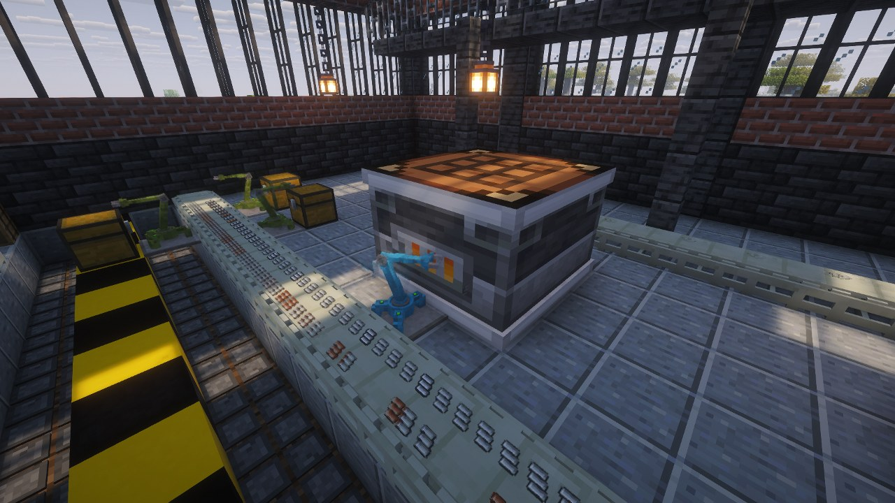
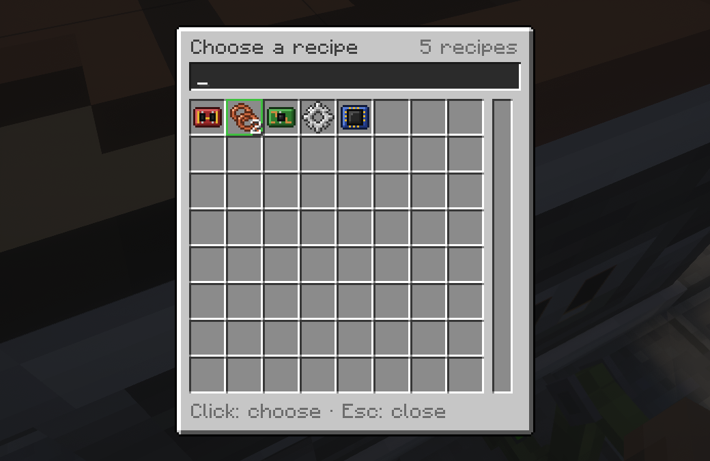
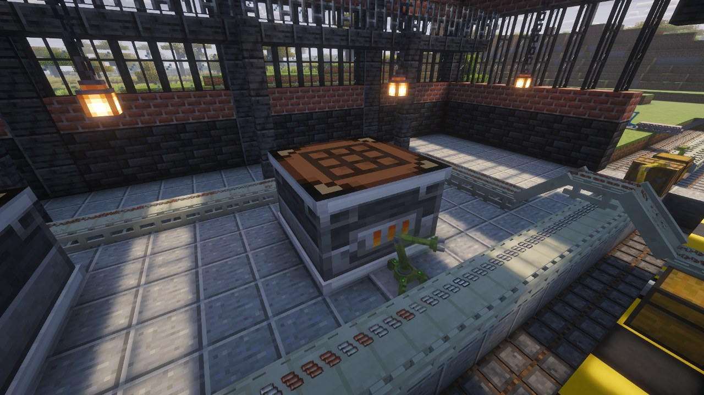

# Crafters

Factorio's assembling machine. Pick a recipe, feed it with inserters, take the result out the
other side. Three tiers, one 3×3 footprint, two blocks tall.

| Crafter | Speed | Power while working | Buffer | Module slots | Fluid tanks |
|---|---|---|---|---|---|
| Mk1 | ×0.50 | 30 FE/t | 20,000 FE | 0 | 8,000 mB |
| Mk2 | ×0.75 | 60 FE/t | 40,000 FE | 2 | 16,000 mB |
| Mk3 | ×1.25 | 150 FE/t | 100,000 FE | 4 | 32,000 mB |

A recipe takes `time ÷ speed`: a 0.5 s gear wheel takes one second in a Mk1, 0.4 s in a Mk3.
Every tier can run every recipe, except those marked for a higher tier — the processing unit needs
at least a Mk2.

> The model is a placeholder, built from vanilla textures. The real one is being drawn.

## Placing it

A crafter is **one item, placed in one go**. The block you aim at becomes the centre of its bottom
layer, and its front faces you. While you hold it, an outline shows the whole volume — **red** when
something is in the way, in which case nothing is placed.

Breaking **any** of its eighteen blocks removes the whole machine. It drops itself and everything
it holds, including the ingredients of a craft in progress.

## Choosing a recipe

Right-click it, then click the **recipe socket** at the top of the screen. The picker lists every
recipe as icons, with a search bar. A recipe the machine's tier cannot run is shown veiled, with a
lock, and its tooltip says which tier it needs.

Right-click the socket to clear the recipe. With **JEI**, the `+` button on a Factor'I/O recipe
sets it directly.

Changing the recipe hands the current inputs back to you; what does not fit in your inventory
drops at your feet. Items already crafted stay in the outputs.

## Feeding it

**Every face of every block is the same.** Put items in from anywhere and they go to the inputs;
take from anywhere and you get the outputs. No side configuration.

The inputs accept **only the recipe's ingredients**, and **at most two crafts ahead** — the
Factorio rule. An inserter pointed at a crafter therefore stops on its own once the machine has
enough, instead of emptying a whole belt into it. Inserters go further: they only pick up an item
the crafter will actually accept, so one inserter on a mixed belt brings exactly what is missing.

Empty input slots show the ingredient they expect, and how many per craft. Slots the recipe does
not use are hatched.

## Running

- **Power** is Forge Energy, drawn **only while crafting** — an idle crafter costs nothing. Out of
  power, the craft pauses and keeps its progress.
- **Ingredients are consumed at the end of the craft.** Until then they sit in their slots, so
  breaking the machine or changing the recipe never loses anything.
- **Leftovers** — the bucket from a milk bucket — go to the outputs.
- **Four output slots**, shared by all results. If a result does not fit, the machine waits.

The light in the title bar says what the machine is doing: **green** working, **yellow** waiting
for ingredients, **orange** blocked by full outputs, **red** needs you (no power, a recipe that
disappeared on `/reload`, or one above the machine's tier), **grey** stopped (no recipe, switched
off, or paused by redstone). The **Information** tab adds the time per craft, the measured rate and the
power draw.

## Modules

Mk2 has two module slots, Mk3 four, in the **Modules** tab. They are the same items as the
inserters' modules, but on a crafter they have Factorio's effects:

| Module | Tier 1 | Tier 2 | Tier 3 |
|---|---|---|---|
| Speed | +20 % speed, +50 % power | +30 % speed, +60 % power | +50 % speed, +70 % power |
| Productivity | +4 % output, −5 % speed, +40 % power | +6 %, −10 %, +60 % | +10 %, −15 %, +80 % |
| Efficiency | −30 % power | −40 % power | −50 % power |

Effects add up, then apply once. Speed and power never drop below 20 % of the base.

**Productivity** fills a bar with every craft. At 100 %, the next craft gives one extra set of
results for free — fluids included. The room for it is reserved in advance, so a bonus is never
lost to a full output.

## Control

The **Control** tab is the inserters' one: an **on/off switch**, which beats any redstone signal,
and the **redstone condition**. Any block of the machine reads the signal.

By default, any signal pauses the crafter. The other modes — run only below a strength, or only at
or above it — need an **Advanced Redstone Module** in a module slot, as on inserters. A Mk1 has no
module slot, so it has the switch and the default reaction only. See
[Filters and Redstone](Filters-and-Redstone).

## Fluids

A recipe can take up to **two fluids** and produce up to two. The machine then shows its tanks:
inputs next to the item inputs, outputs under the item outputs. An empty input tank shows the
fluid it expects.

- Pipes from other mods connect to **any block** of the machine: they fill the inputs and drain
  the outputs.
- Without pipes, **click a tank with a bucket**: a full bucket pours into an input, an empty one
  fills from an output.
- Breaking the machine loses its fluids, as with any vanilla container.

No recipe shipped with the mod uses fluids yet: they are there for datapacks. See the
[Datapack Guide](Datapack-Guide#crafting-recipes).

## Crafting table recipes

A server can let crafters run ordinary crafting table recipes, shaped and shapeless, in
`factor_io-server.toml` — off by default, so the picker is not buried under a thousand recipes.
See [Configuration](Configuration#crafters).

## Building them

| Crafter | Recipe |
|---|---|
| Mk1 | 4 iron plates, 3 iron gear wheels, 1 electronic circuit, 1 crafting table |
| Mk2 | 1 Mk1, 4 steel plates, 2 advanced circuits, 2 gears |
| Mk3 | 1 Mk2, 4 processing units, 4 speed modules |

Each tier is built from the one below, as in Factorio. See [Recipes](Recipes) for the components.
