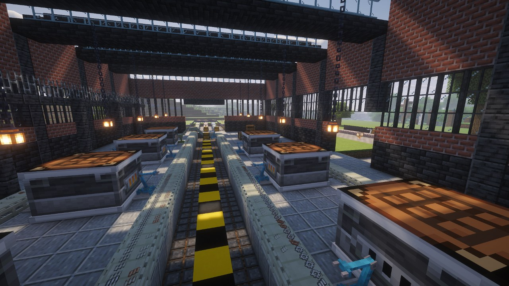

# Factor'I/O

Factorio's inserters, transport belts and assembling machines, in Minecraft. Items move between
the inventories you already have — vanilla or from any other mod — and crafters turn them into
the parts of the next machine.

**Forge 1.20.1** · Java 17 · MIT · **beta**

**[Download on CurseForge](https://www.curseforge.com/minecraft/mc-mods/factoryio)** ·
[GitHub](https://github.com/DrimoZ/FactoryIO) ·
[Discord](https://discord.gg/YY9gk63rKz)

## What is in it

- **Seven inserters**, from the coal-fed burner to the stack filter inserter. They take from the
  block behind and put into the block in front — and only pick up what the target will accept.
- **Transport belts** in three tiers, two lanes each, with curves, side merges and ramps.
- **Crafters**, Factorio's assembling machine, in three tiers: pick a recipe, feed it, collect.
- **Modules** — speed, productivity, efficiency — for both, and an Advanced Redstone Module.
- **Factorio's component chain**: plates, gears, cables, then electronic and advanced circuits and
  processing units.
- **Data-driven**: new inserters, belts and crafters from a JSON file; every number retunable by
  datapack.

## Playing

- **[Getting Started](Getting-Started)** — from ingots to a crafter line
- **[Inserters](Inserters)** — all seven, and what separates them
- **[Transport Belts](Transport-Belts)** — lanes, curves, ramps and the far-lane rule
- **[Crafters](Crafters)** — recipes, feeding, modules, fluids
- **[Modules](Modules)** — what they do in each machine
- **[Filters and Redstone](Filters-and-Redstone)** — item and tag matching, conditions, the
  configurator
- **[Recipes](Recipes)** — the whole component chain

## Running a server or a pack

- **[Configuration](Configuration)** — every option
- **[Datapack Guide](Datapack-Guide)** — add machines, retune them, write crafter recipes
- **[FAQ](FAQ)** · **[Troubleshooting](Troubleshooting)**
