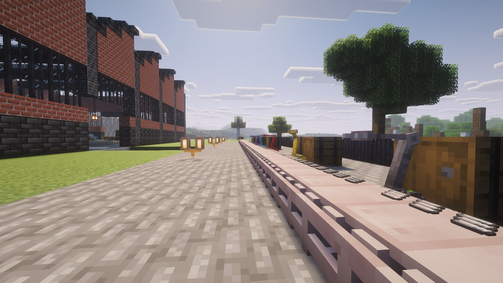
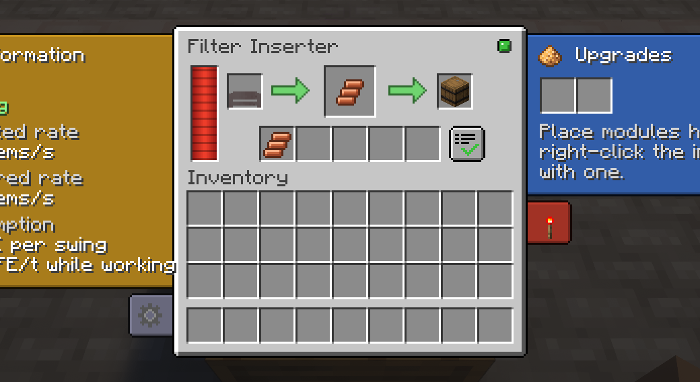

# Inserters

An inserter takes items out of the block behind it and puts them into the block in front.
Everything else is a variation on how fast, how far, and how selectively.

| Inserter | Items/s | Reach | Hand | Filters | Module slots | Power |
|---|---|---|---|---|---|---|
| Burner | 0.59 | 1 | 1 | — | 1 | fuel |
| Inserter | 0.83 | 1 | 1 | — | 2 | 8 FE/t |
| Long Handed | 1.25 | 2 | 1 | — | 2 | 10 FE/t |
| Filter | 0.83 | 1 | 1 | yes | 2 | 10 FE/t |
| Fast | 2.50 | 1 | 1 | — | 3 | 25 FE/t |
| Stack | 7.50 | 1 | 3 | — | 4 | 35 FE/t |
| Stack Filter | 7.50 | 1 | 3 | yes | 4 | 40 FE/t |

Throughput sits within 8 % of Factorio's, converted to 20 ticks per second.

## The three things that differ

**Hand size** is how many items move per swing. Only the stack variants carry more than one, and
it is what makes them worth their cost far more than raw speed does.

**Reach** is how far behind and in front the inserter looks. Only the Long Handed reaches two
blocks, which lets it skip over a belt to take from what is behind it.

**Filtering** decides whether the machine has a filter panel at all. See
[Filters and Redstone](Filters-and-Redstone).

## The screen

Right-click an inserter to open it.

- **The window** shows what the machine is doing: its power on the left, then the block it takes
  from, the item in its hand and the block it drops into — the arrows fill as the arm moves. On
  filtering models the five filter slots sit underneath, with the whitelist/blacklist button at
  the end of the row. Hover the source or target to see what the inserter is actually aimed at.
- **Tabs** slide out of the sides. On the left, **Information** — what the inserter is doing
  right now, the rate it should reach and the rate it actually reaches, and what a swing costs;
  a measured rate well under the expected one means a starving or blocked inserter — and
  **Settings**: the **hand size** (how many items a swing takes, "Max" following capacity
  modules), the **drop lane** on a belt (automatic, near or far) and the **animation**. On the
  right, **Upgrades** (open by default, see [Modules](Modules)) and **Control**: the **on/off** switch — off wins over
  any redstone signal — and the redstone condition.

## What it picks up

An inserter only takes **what its target will accept**, as in Factorio. In front of a crafter, it
brings the missing ingredient rather than one that is already full; in front of a full chest, it
waits with an empty hand. Nothing is ever stuck in its grip.

From a belt it takes from either lane. Onto a belt it drops on the far lane — see
[Transport Belts](Transport-Belts#the-far-lane).

## Crafting

From gears, plates and circuits — see [Recipes](Recipes#machines). Each tier is built from the one
below, as in Factorio.

## Fuel, for the burner

The burner keeps a burn-time reserve and tops it up **from the chest it is already taking from**,
below a threshold. It consumes one fuel item at a time, only when the previous is spent, the way
a vanilla furnace does.

Fuel comes from the `factor_io:inserter_fuel` tag. A fuel richer than the reserve can hold is
refused rather than clipped, so nothing burns away unused.

## Energy, for the rest

Cost is expressed **per swing**, and a swing's duration is what a Speed module shortens. A faster
inserter therefore costs the same per item and more per second — that is the trade, and it is
deliberate.

Energy is accepted on **all six faces**.

## What it will not do

Inserters read block inventories. They ignore **items lying on the ground, minecarts and
entities**. A chest, a furnace, a belt, another mod's machine — anything exposing an
`IItemHandler` — all work.
