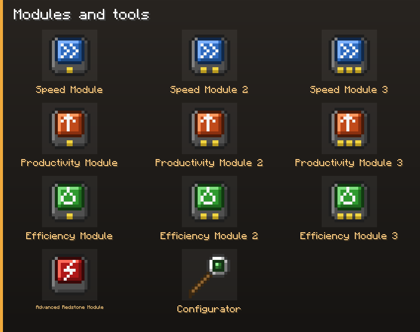
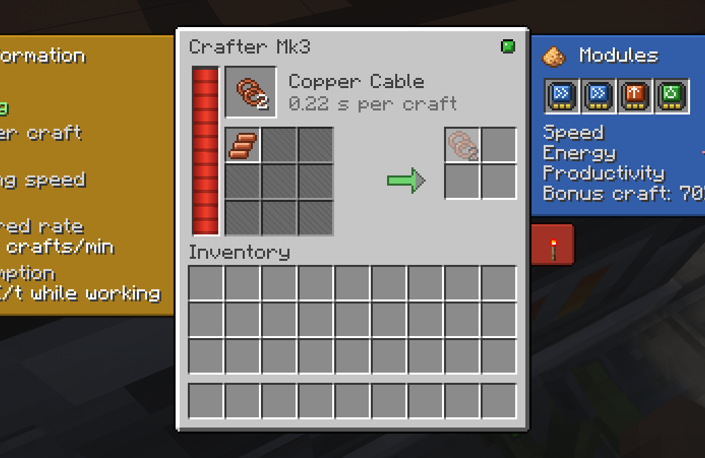

# Modules

Three families — speed, productivity, efficiency — in three tiers, plus the Advanced Redstone
Module. The same items go into inserters and crafters, with an effect suited to each machine.

Right-click a machine with a module to install it in the first free slot, or place it yourself in
the **Upgrades** tab of an inserter or the **Modules** tab of a crafter. The tab shows what the
installed modules change, before → after. Breaking the machine gives them back.

## In an inserter

| Module | Per tier | What it costs |
|---|---|---|
| Speed | −25 % swing duration | nothing per swing, so more power per second |
| Productivity | +1 item per swing | — |
| Efficiency | −25 % power per swing | — |

**Tiers add up.** Two Speed Module 3 are worth more than one; what limits you is the number of
slots, not one module per family. A family stops counting at six summed tiers.

| Inserter | Slots |
|---|---|
| Burner | 1 |
| Inserter, Long Handed, Filter | 2 |
| Fast | 3 |
| Stack, Stack Filter | 4 |

Speed shortens the swing without changing what a swing costs: doubling an inserter's rate doubles
its draw **per second** and leaves its cost **per item** unchanged. Efficiency lowers the cost per
item; Productivity does too, by moving more per swing. Nothing is free — the price is always the
slot.

The hand size setting in the **Settings** tab can cap what Productivity adds, per inserter.

## In a crafter

Mk2 has two slots, Mk3 four, Mk1 none. Here the modules have Factorio's effects:

| Module | Tier 1 | Tier 2 | Tier 3 |
|---|---|---|---|
| Speed | +20 % speed, +50 % power | +30 % speed, +60 % power | +50 % speed, +70 % power |
| Productivity | +4 % output, −5 % speed, +40 % power | +6 %, −10 %, +60 % | +10 %, −15 %, +80 % |
| Efficiency | −30 % power | −40 % power | −50 % power |

Effects add up, then apply once; speed and power never fall below 20 % of the base. Productivity
fills a bar, and every full bar gives one extra set of results. See [Crafters](Crafters#modules).

## Advanced Redstone Module

Without it, a redstone signal simply pauses the machine. With it, in any module slot, the machine
gets the full redstone condition: run only below a signal strength, or only at or above it. It has
no other effect. See [Filters and Redstone](Filters-and-Redstone#redstone).

## For pack makers

Modules are recognised by **tags**, `factor_io:upgrades/<family>/<tier>` — `speed`, `capacity`
(the productivity modules) and `efficiency` — plus `factor_io:upgrades/advanced_redstone`. Any
item can act as a Speed 2 by joining `factor_io:upgrades/speed/2`. The inserter percentages, the six-tier ceiling and which abilities
need a module are set by datapack: see [Datapack Guide](Datapack-Guide#retuning-the-modules).

Recipes are on the [Recipes](Recipes#modules-and-tools) page.
