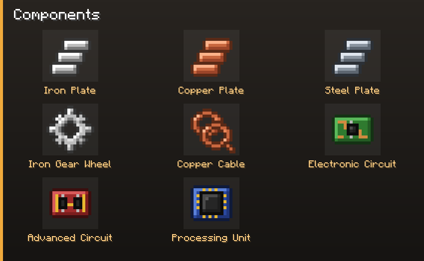
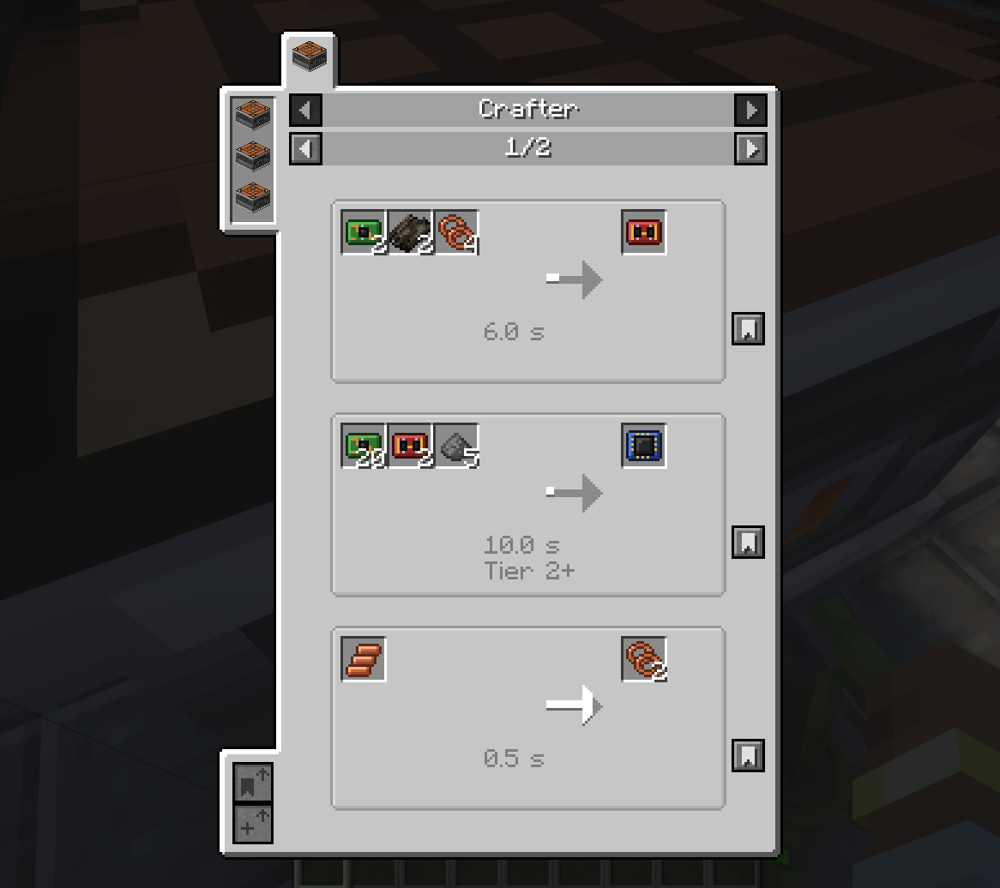

# Recipes

Factorio's component chain, brought to Minecraft. Plates and gears by hand, circuits by hand at
first, and the complex parts in a [crafter](Crafters) — the processing unit needs twenty
electronic circuits, which is exactly where a crafting grid stops making sense.

Every ingredient is a Forge **tag** where one exists: `forge:plates/iron`, `forge:gears/iron`,
`forge:wires/copper`, `forge:circuits/basic`, `/advanced`, `/elite`. Plates and circuits from
other mods work in these recipes, and ours work in theirs. **JEI** shows all of it, crafter
recipes included.

## The chain

| Step | Where | Recipe |
|---|---|---|
| Iron plate, copper plate | stonecutter | 1 ingot → 1 plate |
| Steel plate | blast furnace | 1 iron plate |
| Iron gear wheel | crafting table or crafter | 2 iron plates |
| Copper cable | crafting table or crafter | 1 copper plate → 2 |
| Electronic circuit | crafting table or crafter | 1 iron plate + 3 copper cables |
| Advanced circuit | **crafter only** | 2 electronic circuits + 2 dried kelp + 4 copper cables, 6 s |
| Processing unit | **crafter Mk2 or better** | 20 electronic circuits + 2 advanced circuits + 5 gunpowder, 10 s |

Dried kelp stands in for plastic and gunpowder for sulfuric acid, until those exist.

## Machines

| Item | Recipe |
|---|---|
| Burner Inserter | 1 gear + 1 iron plate |
| Inserter | 1 electronic circuit + 1 gear + 1 iron plate |
| Long Handed Inserter | 1 inserter + 1 gear + 1 iron plate |
| Fast Inserter | 1 inserter + 2 electronic circuits + 2 iron plates |
| Filter Inserter | 1 inserter + 4 electronic circuits |
| Stack Inserter | 1 fast inserter + 4 gears + 3 electronic circuits + 1 advanced circuit |
| Stack Filter Inserter | 1 stack inserter + 4 electronic circuits |
| Transport Belt | 2 iron plates + 1 gear → 4 |
| Fast Transport Belt | 1 transport belt + 5 gears |
| Express Transport Belt | 1 fast transport belt + 4 gears + 2 slimeballs |
| Belt ramp, each tier | 1 belt of that tier + 1 iron plate |
| Crafter Mk1 | 4 iron plates + 3 gears + 1 electronic circuit + 1 crafting table |
| Crafter Mk2 | 1 crafter Mk1 + 4 steel plates + 2 advanced circuits + 2 gears |
| Crafter Mk3 | 1 crafter Mk2 + 4 processing units + 4 speed modules |

One departure from Factorio: the Filter inserter is built from the plain one, not the fast one,
because here it runs at the plain inserter's speed. The slimeball stands in for lubricant.

## Modules and tools

**Tier 1 modules** — 4 electronic and 4 advanced circuits around a core. **Tiers 2 and 3** — 2
modules of the tier below, 3 processing units and 3 advanced circuits around a core. Factorio gives
the three families the same recipe; the core tells them apart:

| | Tier 1 | Tier 2 | Tier 3 |
|---|---|---|---|
| Speed | sugar | rabbit's foot | phantom membrane |
| Productivity | piston | sticky piston | shulker shell |
| Efficiency | lapis lazuli | amethyst shard | echo shard |

| Item | Recipe |
|---|---|
| Advanced Redstone Module | 1 comparator + 4 redstone dust + 4 electronic circuits |
| Configurator | 1 iron plate + 2 copper cables + 1 redstone dust |

## Items with no use yet

Science packs, rocket parts, fuels and uranium cells are registered for the machines to come. They
have no recipe and are hidden from the creative tab, so a world that holds some loses nothing.
