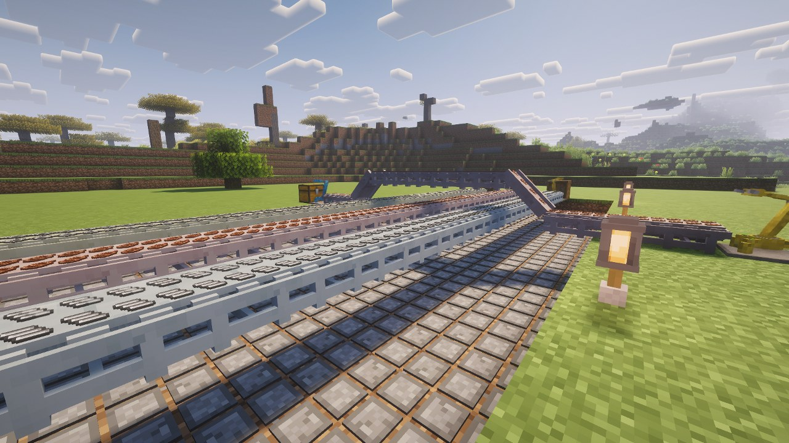
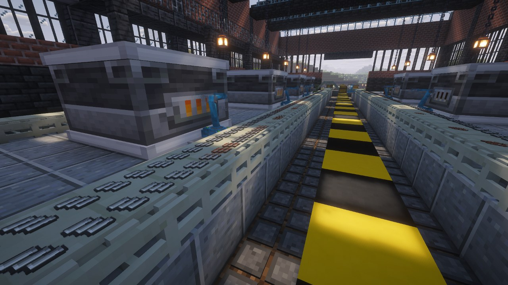
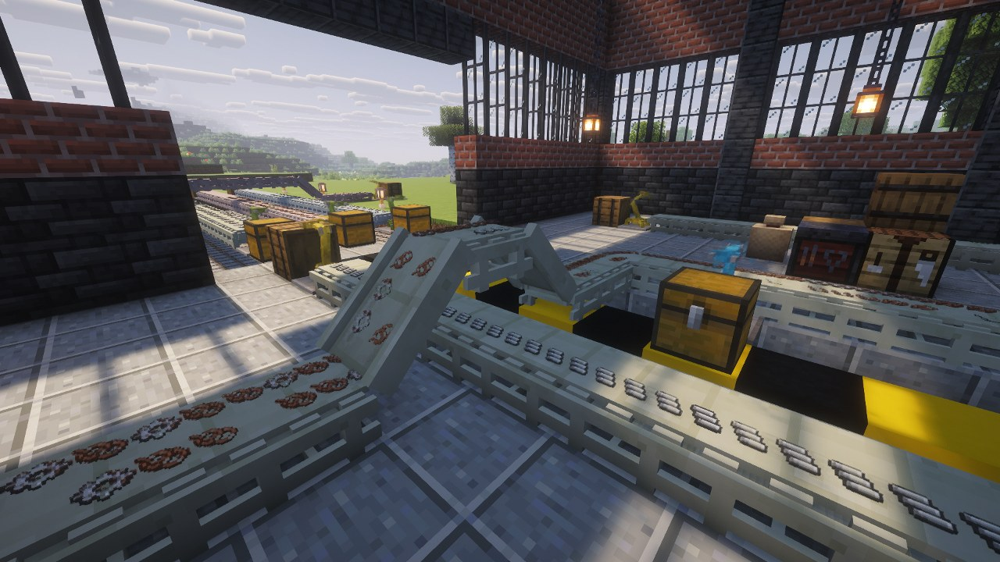

# Transport Belts

| Belt | Items/s | Ticks per slot | Carries |
|---|---|---|---|
| Transport Belt | 10 | 4 | 8 items |
| Fast Transport Belt | 20 | 2 | 8 items |
| Express Transport Belt | 40 | 1 | 8 items |

Each block holds **two lanes of four slots**, so eight items, as in Factorio. Speed is set in
ticks per slot, per belt, [by datapack](Datapack-Guide#belts), and modpacks can [add their own belts](Datapack-Guide#creating-a-belt).

| Belt | Recipe |
|---|---|
| Transport Belt | 2 iron plates + 1 iron gear wheel → 4 |
| Fast Transport Belt | 1 transport belt + 5 gears |
| Express Transport Belt | 1 fast transport belt + 4 gears + 2 slimeballs |

As in Factorio, each tier is built from the one below. The slimeball stands in for lubricant.

## Direction and shape

A belt outputs in the direction you were facing when you placed it. It looks for inputs
**behind and to its sides — never in front**.

A belt whose only input arrives from a side draws itself as a **curve**. Two side inputs make a
merge, not a corner: the belt stays straight and both feeds butt against it.

Two belts facing each other do nothing. Their outputs share a face, so nothing can pass without
crossing, and both simply back up.

## The far lane

**An inserter drops on the lane furthest from it.** This is the rule every two-lane build rests
on: one inserter on each side of a belt fills both lanes independently, and a single inserter
never touches the far side's reserve.

By default, an inserter falls back to the near lane once the far one is full, so that it never
stalls in front of a belt that visibly has room. Set `insert_on_far_lane_only` to make it wait
instead, which is what Factorio does.

Each inserter can also be told which lane to use, in the **Settings** tab of its screen: near or
far overrides both the default and the config, for that inserter only.

The rule is enforced by the belt, from the face the request arrives on. **Hoppers and pipes from
other mods follow it too**, without knowing belts exist.

## Loading and unloading

A belt exposes an inventory on **every face**:

- a hopper **above** loads it;
- a hopper **below** drains it, taking the **front-most** item first — a belt is a queue;
- anything with an `IItemHandler` can do both.

A belt never pushes into a chest by itself, and never pulls from one. That is the inserter's job,
and it is the Factorio behaviour.

## Jams and loops

A belt with nowhere to go fills and stops, and the backup travels upstream one slot per step. A
**closed loop that is completely full keeps turning** — it does not deadlock.

## By hand

Right-click with an item to drop one on the lane and slot you clicked; right-click empty-handed
to take the front-most one back. To place a block on top of a belt, sneak, as vanilla expects.

## Ramps

Each tier has a **ramp**, to climb or descend one block. A ramp placed below the end of a belt goes
down; anywhere else it goes up. It is crafted from a belt of its tier and an iron plate.

> The ramp models are placeholders.

## Not yet

**Splitters** do not exist yet; they are next. Underground belts are out of scope.
